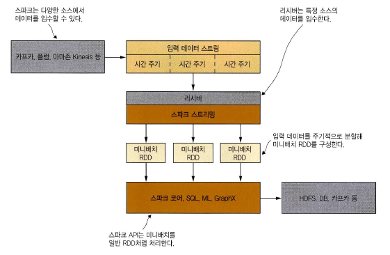
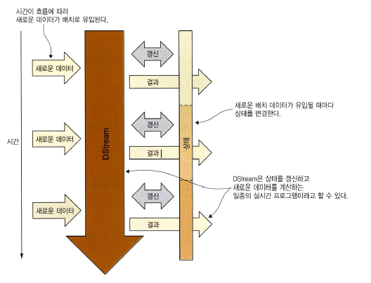
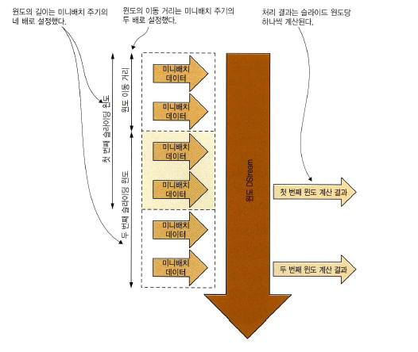
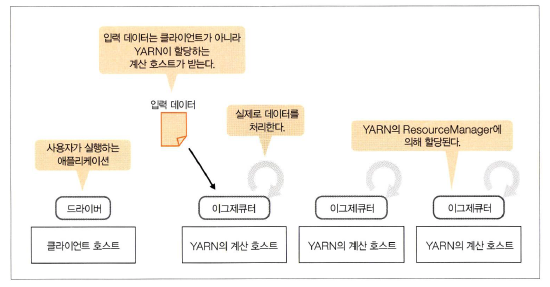

# 6장 스파크 스트리밍


## 학습 내용

1. 파일 시스템에서 스트림을 받아 다시 파일에 저장
2. 카프카(분산 메시지 큐 시스템) 사용
3. 스트리밍 성능 최적화

## 6.1 스파크 스트리밍 애플리케이션 작성

### 6.1.0 소개

#### 배치 처리

일반적인 데이터는 스토리지에 저장된 데이터를 읽어서 특정 처리를 하고, 그 결과를 다시 스토리지에 저장한다.

#### 스트림 처리

스트림 데이터는 이미 스토리지에 저장된 하나의 큰 데이터가 아닌 반영구적으로 계속해서 생성되는 데이터를 말한다. 특히 짧은 시간 간격으로 생성되는 것이 특징. 센서 등 기기에서 생성되는 수치 데이터 또는 웹 시스템에서 사용자 접근 로그, 사용자 구매 활동에 따른 재고 변동 데이터 등. 이런 데이터를 쌓아가며 처리하는 것이 아니라 쌓지 않고 바로바로 처리하는 것을 목표로 한다. 짧은 간격으로 준 실시간으로 데이터를 처리하고 그 결과를 외부에 제공.


#### mini-batch

입력 데이터 스트림을 짧은 시간 주기로 잘라 RDD로 만든다. 미니배치 RDD는 일반 RDD처럼 처리할 수 있다.



### 6.1.1 예제 애플리케이션

#### 증권사 대시보드 애플리케이션

- 고객은 애플리케이션으로 거래 주문 요청하고, 증권사 담당자는 주문을 받아 실제 거래 진행.
- 우리가 계산할 것
  - 초당 거래 주문 건수
  - 누적 거래액이 가장 많은 고객 1~5위
  - 지난 1시간 동안 거래량 가장 많은 증권 1~5위

### 6.1.2 스트리밍 컨텍스트 생성

실습은 스파크 쉘 기준으로 진행

4개 쓰레드를 이용해 로컬 클러스터 실행

```shell
$ spark-shell --master local[4]
```

StreamingContext 인스턴스 생성하자. 미니배치 RDD를 생성할 시간 간격을 지정해야하는데 이건 활용 목적과 성능 요구 사항, 클러스터 용량 등에 따라 다를 것. 지금은 5초로 한다.

```scala
import org.apache.spark._
import org.apache.spark.streaming._
val ssc = new StreamingContext(sc, Seconds(5))
```

쉘이 아니라 독립적인 애플리케이션에서 생성할 때는 SparkContext 재사용하지 않고 새롭게 생성할 수 있다(스파크 쉘에서는 sc가 있어서 할 필요도 없고 두 개 이상을 동일 JVM에 초기화 할 수도 없다).

```scala
val conf = new SparkConf().setMaster("local[4]").setAppName("App name")
val ssc = new StreamingContext(conf, Second(5))
```

### 6.1.3 이산(separation) 스트림 생성

#### 6.1.3.1 예제 데이터 내려받기

거래 주문 50만건

- 주문 시각: yyyy-MM-dd HH:mm:ss
- 주문 ID: 순차 증가 정수
- 고객 ID: 1~100 무작위 정수
- 주식 종목 코드: 80개 주식 종목 코드 목록 중 무작위 선택 값
- 주문 수량: 1~1000 무작위 정수
- 매매 가격: 1~100 무작위 정수
- 주문 유형: 매수(B), 매도(S)

```shell
# vagrant 사용하지 않는 경우는 깃허브 저장소에서 받으면 됨
$ cd /home/spark/first-edition/ch06
$ tar xvfz orders.tar.gz
```

그러면 다음과 같은 *orders.txt* 생김.

```
2016-03-22 20:25:28,1,80,EPE,710,51.00,B
2016-03-22 20:25:28,2,70,NFLX,158,8.00,B
2016-03-22 20:25:28,3,53,VALE,284,5.00,B
2016-03-22 20:25:28,4,14,SRPT,183,34.00,B
2016-03-22 20:25:28,5,62,BP,241,36.00,S
2016-03-22 20:25:28,6,52,MNKD,296,28.00,S
...
```

데이터 소스는 여러가지가 있지만 StreamingContext 의 textFileStream 메서드를 이용해 파일의 텍스트 데이터를 스트리밍으로 받을 것. HDFS, 아마존 S3, GlusterFS, 로컬 디렉터리 등 하둡과 호환되는 모든 유형의 디렉토리를 지정할 수 있다. 

주의할 것은 이미 있는 데이터를 읽는게 아니라 새로 생기는 데이터만 읽는다. 따라서 거래 주문 50만건을 한번에 읽는게 아니라 *splitAndSend.sh* 를 이용해서 1만개씩 분할해 HDFS 디렉터리에 3초 주기로 복사한다(총 50개 파일).

#### 6.1.3.2 DStream 객체 생성

분할된 파일은 `/home/spark/ch06input` 폴더에 저장되고 우리는 거기서 데이터를 읽어오도록 한다.

```scala
// Dtream 인스턴스 리턴
val filestream = ssc.textFileStream("/home/spark/ch06input")
```

### 6.1.4 이산 스트림 사용

여태까지 배운 RDD 데이터를 사용하면 됨.

#### 6.1.4.1 데이터 파싱

주문 데이터를 담을 `Order` 클래스 정의.

```scala
import java.sql.Timestamp
case class Order(time: java.sql.Timestamp, 
                 orderId:Long, 
                 clientId:Long, 
                 symbol:String, 
                 amount:Int, 
                 price:Double, 
                 buy:Boolean)
```

일단 각 줄을 파싱해서 Order 객체로 변환하고 리스트에 담자.

```scala
import java.text.SimpleDateFormat
val orders = filestream.flatMap(line => {
    val dateFormat = new SimpleDateFormat("yyyy-MM-dd hh:mm:ss")
    val s = line.split(",")
    try {
        assert(s(6) == "B" || s(6) == "S")
        List(Order(new Timestamp(dateFormat.parse(s(0)).getTime()), 
                   s(1).toLong, 
                   s(2).toLong, 
                   s(3), 
                   s(4).toInt, 
                   s(5).toDouble, 
                   s(6) == "B"))
    }
    catch {
        case e : Throwable => println("Wrong line format ("+e+"): "+line)
        List()
    }
})
```

#### 6.1.4.2 거래 주문 건수 집계

2-요소 튜플로 구성된 RDD는 `pairRDDFunctions` 인스턴스로 암시적 변환된다. `PairDStreamFunctions`을 이용해 여러가지 변환 함수를 사용할 수 있다.

각 주문을 `(Boolean, Long)`로 변환해서 모두 더함. 매수 주문(true)의 건수와 매도 주문(false)의 건수를 구할 수 있음.

```scala 
val numPerType = orders.map(o => (o.buy, 1L)).reduceByKey((c1, c2) => c1 + c2)
```

### 6.1.5 결과를 파일로 저장

결과는 파티션별로 각자 저장하는데 이걸 하나의 파일로 합쳐서 저장하도록 하자. numPerType의 각 RDD가 가진 요소는 최대 두 개 뿐이므로 단일 파티션에 저장하더라도 메모리 문제는 없을 것.

```scala
numPerType.repartition(1).saveAsTextFiles("/home/spark/ch06output/output", "txt")
```

하둡과 호환되는 분산 파일 시스템에 저장하는데 로컬 클러스터에서 실행하므로 로컬 파일 시스템에 저장됨.

### 6.1.6 스트리밍 계산 작업의 시작과 종료

여태까지 스트리밍을 실행하지 않았기 때문에 작업을 지정했어도 아무런 일이 발생하지 않았다(Lazy-evaluation). 이제 스트리밍 ㄱㄱ하자. 동일 JVM 에서는 `StreamingContext`를 한 번에 하나밖에 시작할 수 없다.

```scala
ssc.start()

// 얘는 독립형 애플리케이션에서 필요
// 스파크 스트리밍의 계산 작업을 종료할 때까지 기다리게 함.
// 이거 안하면 그냥 끝남.
// ssc.awaitTermination() 
```

#### 6.1.6.1 스파크 스트리밍으로 데이터 전송

시작했으니 이제 데이터를 넣어야 한다.

```shell
$ cd /home/spark
$ chmod +x first-edition/ch06/splitAndSend.sh
$ mkdir /home/spark/ch06input
$ cd first-edition/ch06
$ ./splitAndSend.sh /home/spark/ch06input local
```

2분 30초 정도 지나면 모든 파일이 처리된다. 쉘에서 종료하려면

```scala
ssc.stop(false)
```

종료된 스트리밍 컨텍스트는 다시 시작할 수 없고, 스파크 컨텍스트를 이용해서 새로운 스트리밍 컨텍스트를 생성해야 한다.

#### 6.1.6.3 출력 결과

각 미니배치별로 폴더가 생성되어 있다. `_SUCCESS`는 이 폴더의 쓰기 작업을 성공했다는 걸 나타내는 파일이다.

```
# part-00000의 예
(false,9969)
(true,10031)
```

 여러 폴더를 한꺼번에 읽어서 RDD로 만들 수 있다.

```scala
val allCounts = sc.textFile("/home/spark/ch06output/output*.txt")
```

### 6.1.7 시간에 따라 변화하는 계산 상태 저장

거래액 1~5위의 고객 목록을 계산하려면 각 고객이 현재까지 주문한 매매 가격을 계속 누적해야 한다. 시간과 미니배치에 따라 변화화는 상태(state)를 지속적으로 유지해야 한다. `DStream`은 미니 배치로 입수된 새로운 데이터와 마지막 상태에 저장된 과거 데이터를 결합하고 계산한 후 상태를 갱신한다.



#### 6.1.7.1 updateStateByKey로 상태 유지

스트리밍 컨텍스트는 한번 종료되면 다시 실행할 수 없어서 새로 생성해야 한다. 처음부터 다시 간다.

```scala
import org.apache.spark._
import org.apache.spark.streaming._
val ssc = new StreamingContext(sc, Seconds(5))
val filestream = ssc.textFileStream("/home/spark/ch06input")
import java.sql.Timestamp
case class Order(time: java.sql.Timestamp, 
                 orderId:Long, 
                 clientId:Long, 
                 symbol:String, 
                 amount:Int, 
                 price:Double, 
                 buy:Boolean)
import java.text.SimpleDateFormat
val orders = filestream.flatMap(line => {
    val dateFormat = new SimpleDateFormat("yyyy-MM-dd hh:mm:ss")
    val s = line.split(",")
    try {
        assert(s(6) == "B" || s(6) == "S")
        List(Order(new Timestamp(dateFormat.parse(s(0)).getTime()), 
                   s(1).toLong, 
                   s(2).toLong, 
                   s(3), 
                   s(4).toInt, 
                   s(5).toDouble, 
                   s(6) == "B"))
    }
    catch {
        case e : Throwable => println("Wrong line format ("+e+"): "+line)
        List()
    }
})
val numPerType = orders.map(o => (o.buy, 1L)).reduceByKey((c1, c2) => c1 + c2)
```

이 메소드는 **과거의 계산 상태를 현재 계산에 반영할 수 있는 메소드**인데 `Pair DStream` 에서만 동작한다. 고객 ID를 키로 지정하고 거래액(주문 수량 * 매매 가격)을 값으로 지정한 `Pair DStream` 을 만들자. 

```scala
// DStream[고객ID(Long), 거래액(Double)]
val amountPerClient = orders.map(o => (o.clientId, o.amount * o.price))
```

이 메소드는 각 키의 상태 값을 포함한 새로운 `State DStream` 객체를 리턴한다. 다음 시그니처의 함수를 정의해서 인자로 전달해야 함.

```scala
(Seq[V], Option[S]) => Option[S]
```

- 첫 번째 인수 - 현재 미니배치에 유입된 각 키의 Seq 객체가 전달됨. 키의 상태를 계산한 적은 있지만 해당 키 값이 현재 미니배치에 유입되지 않은 경우엔 빈 Seq 객체가 전달됨.
- 두 번째 인수 - 키의 상태 값이 Option으로 전달. 해당 키 값이 현재 미니배치에 유입되지 않은 경우에는 None이 전달됨.

```scala
val amountState = amountPerClient.updateStateByKey((vals, totalOpt:Option[Double]) => {
  totalOpt match {
    case Some(total) => Some(vals.sum + total) // 이 키의 상태가 존재할 때는 상태 값에 새로 유입된 값의 합계를 더함
    case None => Some(vals.sum) // 반면 이전 상태 값이 없을 때는 새로 유입된 합계만 리턴
  }
})
```

참고로 `Option`은 null 을 방지하기 위해 쓰는 것. 자바의 `Optional` 같이. 하위 클래스로 `Some[T]`와 `None`이 있다.

```scala
opt match {
  case Some(value) => operate(value)
  case None => defaultAction()
}
```

이제 거래액 1~5위 고객을 계산할 차례. 먼저 각 RDD를 정렬한 후에 각 RDD에서 상위 다섯 개 요소만 남겨야 한다. `zipWithIndex`는 RDD의 각 요소에 번호를 부여하고, 상위 다섯 개 번호를 제외한 모든 요소를 필터링으로 제거한다.

```scala
val top5clients = amountState.transform(_.sortBy(_._2, false)
                                        .map(_._1)
                                        .zipWithIndex
                                        .filter(x => x._2 < 5))
```

#### 6.1.7.2 union으로 두 DStream 병합

지금까지 계산한 초당 거래 주문 건수와 거래액 1~5위 고객을 배치 간격당 한 번씩만 저장하려면, 두 결과 `DStream`을 단일 `DStream`으로 병합해야 한다.

union 메소드로 병합하려면 요소 타입이 서로 동일해야 한다. 그래서 두 가지 DStream의 요소를 2-요소 튜플로 통일할 것이다.

- 첫 번째 요소: 각 지표를 설명하는 키(BUYS, SELLS, TOP5CLIENTS)
- 두 번째 요소: 문자열 리스트(거래액 1~5위 고객의 목록이 리스트 타입이라서 이걸로 통일).

```scala
// true: 매수 주문 건수
// false: 매도 주문 건수
val buySellList = numPerType.map(t => 
                                 if(t._1) ("BUYS", List(t._2.toString)) 
                                 else ("SELLS", List(t._2.toString)))

// 단일 파티션으로 모으고
// 고객 ID만 남기고
// 모든 고객 ID를 단일 배열로 모으고
// 지표 이름을 키로 추가함
val top5clList = top5clients.repartition(1).map(x => x._1.toString).glom().map(arr => ("TOP5CLIENTS", arr.toList))
```

이제 병합한 후 `DStream`을 파일에 저장하자.

```scala
val finalStream = buySellList.union(top5clList)
finalStream.repartition(1).saveAsTextFiles("/home/spark/ch06output/output", "txt")
```

#### 6.1.7.3 체크포인팅 디렉터리 지정

스트리밍 컨텍스트를 시작하기 전 체크포인팅 디렉터리를 지정하자.

```scala
sc.setCheckpointDir("/home/spark/checkpoint/")
```

4장에서 설명했듯이(?) 스파크는 RDD 데이터와 전체 DAG(RDD의 계산 계획)를 체크포인트로 저장할 수 있으며, 비정상적으로 종료해도 RDD를 처음부터 계산할 필요 없이 저장 데이터를 바로 로드할 수 있다.

`updateStateByKey` 메소드를 사용할 때는 메서드가 반환하는 `State DStream`에 체크포인팅을 반드시 지정해야 한다. 왜냐하면 각 미니배치마다 RDD의 DAG를 계속 연장하면서 스택 오버플로 오류를 유발하기 때문이다. 따라서 주기적으로 체크포인트에 저장해야 DAG가 과거의 미니배치에 의존하지 않는다.

#### 6.1.7.4 두 번째 출력 결과

시작 전에 폴더 정리부터.

```shell
$ rm -f /home/spark/ch06input/*
```

이제 스트리밍 컨텍스트 시작하고

```scala
ssc.start()
```

 `splitAndSend.sh` 스크립트 다시 시작하자.

```shell
$ cd /home/spark/first-edition/ch06
$ ./splitAndSend.sh /home/spark/ch06input local
```

그럼 다음과 비슷하게 결과가 나온다.

```scala
(SELLS,List(10067))
(BUYS,List(9933))
(TOP5CLIENTS,List(87, 23, 70, 15, 10))
```

굿 잡! 👏🏻

#### 6.1.7.5 mapWithState

이 메서드는 기존 `updateStateByKey` 를 개선한 메소드로 스파크 1.6부터 사용할 수 있다.

가장 큰 차이점은 상태 값의 타입과 리턴 값의 타입을 다르게 적용할 수 있다는 것이다. `mapWithState` 메서드는 `StateSpec` 인스턴스만 인수로 받는다. 이 인스턴스는 `mapWithState` 설정에 사용되는데 `StateSpec` 객체를 초기화하려면 `StateSpec.function` 메서드에 다음과 같은 함수를 전달해야 한다.

```scala
// updateStateByKey에 들어가는 함수 시그니처
(Seq[V], Option[S]) => Option[S]

// StateSpec.function 메서드에 들어가는 함수 시그니처
(Time, KeyType, Option[ValueType], State[StateType]) => Option[MappedType]
```

네 번째 인자인 State는 각 키의 상태 값을 저장하는 객체로, 상태 값을 다룰 수 있는 유용한 메서드를 제공한다.

- exists
- get
- remove
- update

여기서 다시 실습하려면 앞에서 했던 내용 다시 쳐서 해봐야한다. 일단 눈으로 보고 밑에서 다른 거 실습할 때 어차피 다시 쳐야 하므로 그 때 해보자.

```scala
// updateStateByKey 메서드에서 사용하는 함수
(vals, totalOpt:Option[Double]) => {
  totalOpt match {
    case Some(total) => Some(vals.sum + total)
    case None => Some(vals.sum)
  }
}

val updateAmountState = (time:Time, clientId:Long, amount:Option[Double], state:State[Double]) => {
    var total = amount.getOrElse(0.toDouble) // 새로 유입된 값을 새로운 값으로 설정. 없으면 0.
    if(state.exists())
        total += state.get() // 새로운 상태 값에 기존 상태 값을 더한다.
    state.update(total) // 새로운 상태 값으로 갱신
    Some((clientId, total)) // (고객ID, 상태값) 2-요소 튜플로 리턴
}
```

만든 함수를 넣어서 `amountState`를 계산하자. 마지막에 `stateSnapshots()`를 호출하지 않으면 현재 미니배치 주기 사이에 거래를 주문했던 애들만 포함된다. 이걸 호출해야 전체 내용이 다 나옴.

```scala
val amountState = amountPerClient.mapWithState(StateSpec.function(updateAmountState)).stateSnapshots()
```

이 외에도 파티션 개수, `Partitioner` 객체, 초기 상태 값을 담은 RDD, 제한시간 등을 설정할 수 있다. 특히 초기 상태 값을 지정하는 기능을 활용하면 스트리밍 작업을 종료했다가 다시 시작하는 경우 이전값을 사용할 수 있다. 예를 들어 예제 애플리케이션에서 하루 주식 시장을 마감할 때 고객 목록과 누적 거래액을 저장한 후, 다음 날 전날 상태를 불러와 계속 누적할 수 있다. 

```scala
StateSpec.function(updateAmountState).numPartitions(10).timeout(Minutes(30))
```

마지막으로 성능 면에서도 우수하다. 키별 상태를 열 배 더 많이 유지할 수 있으며 처리 속도는 여섯 배나 더 빠르다. 왜냐하면 새로 유입된 데이터가 없는 키를 연산에서 제외하는 아이디어 때문이다.

### 6.1.8 윈도 연산으로 일정 시간 동안 유입된 데이터만 계산

마지막 미션은 지난 1시간 동안 거래량이 가장 많았던 유가 증권 1~5위를 찾는 것이다. 이 지표는 일정 시간 내의 데이터만 계산하기 때문에 앞선 누적과는 좀 다르다. 이럴 때 윈도 연산을 사용할 수 있다.

슬라이딩 윈도는 윈도가 쭉 움직이는건데 슬라이딩 윈도의 길이와 이동 거리(윈도 데이터를 얼마나 자주 계산할지)를 바탕으로 윈도 `DStream`을 생성한다. 그림에서는 슬라이딩 윈도의 이동 거리와 길이는 각각 미니배치 주기의 두 배와 네 배로 설정함. 슬라이딩 윈도의 길이와 거리는 반드시 미니배치 주기의 배수여야 한다. 결과는 윈도당 하나씩 계산된다.



#### 6.1.8.1 윈도 연산을 사용해 마지막 지표 계산

- 지난 1시간의 누적을 계산해야 하므로 윈도의 길이는 1시간이 되어야 한다. 
- 이동거리는 계산을 미니배치마다 해야하므로 미니배치 주기와 동일하게 5초로 설정.

다시 처음부터 해야한다!!! 😇🙏🏻

```scala
import org.apache.spark._
import org.apache.spark.streaming._
val ssc = new StreamingContext(sc, Seconds(5))
val filestream = ssc.textFileStream("/home/spark/ch06input")
import java.sql.Timestamp
case class Order(time: java.sql.Timestamp, 
                 orderId:Long, 
                 clientId:Long, 
                 symbol:String, 
                 amount:Int, 
                 price:Double, 
                 buy:Boolean)
import java.text.SimpleDateFormat
val orders = filestream.flatMap(line => {
    val dateFormat = new SimpleDateFormat("yyyy-MM-dd hh:mm:ss")
    val s = line.split(",")
    try {
        assert(s(6) == "B" || s(6) == "S")
        List(Order(new Timestamp(dateFormat.parse(s(0)).getTime()), 
                   s(1).toLong, 
                   s(2).toLong, 
                   s(3), 
                   s(4).toInt, 
                   s(5).toDouble, 
                   s(6) == "B"))
    }
    catch {
        case e : Throwable => println("Wrong line format ("+e+"): "+line)
        List()
    }
})
val numPerType = orders.map(o => (o.buy, 1L)).reduceByKey((c1, c2) => c1 + c2)
val amountPerClient = orders.map(o => (o.clientId, o.amount * o.price))
val updateAmountState = (time:Time, clientId:Long, amount:Option[Double], state:State[Double]) => {
    var total = amount.getOrElse(0.toDouble)
    if(state.exists())
        total += state.get()
    state.update(total)
    Some((clientId, total))
}
val amountState = amountPerClient.mapWithState(StateSpec.function(updateAmountState)).stateSnapshots()


val top5clients = amountState.transform(_.sortBy(_._2, false)
                                        .map(_._1)
                                        .zipWithIndex
                                        .filter(x => x._2 < 5))
val buySellList = numPerType.map(t => 
                                 if(t._1) ("BUYS", List(t._2.toString)) 
                                 else ("SELLS", List(t._2.toString)))

val top5clList = top5clients.repartition(1).map(x => x._1.toString).glom().map(arr => ("TOP5CLIENTS", arr.toList))

// 생성
val stocksPerWindow = orders.map(x => (x.symbol, x.amount)).reduceByKeyAndWindow((a1:Int, a2:Int) => a1 + a2, Minutes(60))

// 포맷 맞게 변환
val topStocks = stocksPerWindow.transform(_.sortBy(_._2, false).map(_._1).
  zipWithIndex.filter(x => x._2 < 5)).repartition(1).
    map(x => x._1.toString).glom().
    map(arr => ("TOP5STOCKS", arr.toList))

// 스트림 하나 더 union
val finalStream = buySellList.union(top5clList).union(topStocks)
finalStream.repartition(1).saveAsTextFiles("/home/spark/ch06output/output", "txt")
sc.setCheckpointDir("/home/spark/checkpoint/")
```

시작 전에 폴더 정리부터.

```shell
$ rm -f /home/spark/ch06input/*
```

이제 스트리밍 컨텍스트 시작하고

```scala
ssc.start()
```

 `splitAndSend.sh` 스크립트 다시 시작하자.

```shell
$ cd /home/spark/first-edition/ch06
$ ./splitAndSend.sh /home/spark/ch06input local
```

그럼 다음과 비슷하게 결과가 나온다.

```
(SELLS,List(10034))
(BUYS,List(9966))
(TOP5CLIENTS,List(15, 64, 23, 55, 69))
(TOP5STOCKS,List(AMD, INTC, BP, TOT, BBL))
```

굿 보이 👍🏻

### 6.1.9 그 외 내장 입력 스트림

앞 예제에서는 textFileStream 을 사용했는데 이 외에도 다양한 메서드로 데이터를 수신하고 `DStream` 을 생성할 수 있다.

- 파일 입력 스트림: `binaryRecordsStream`, `fileStream`
- 소켓 입력 스트림: `socketStream`, `socketTextStream`

## 6.2 외부 데이터 소스 사용

지금까지는 내장 데이터 소스(파일 및 소켓)를 사용했고, 이제 외부 데이터 소스에 연결해보자. 다음은 스파크가 공식적으로 커넥터를 지원하는 외부 시스템 및 프로토콜이다.

- [Kafka 카프카](https://kafka.apache.org/): 빠른 성능과 확장성을 갖춘 분산 publish-subscribe 메시징 시스템. 모든 메시지를 유지하며 유실된 데이터를 재전송할 수 있음.
- [Flume 플럼](https://flume.apache.org/): 대량의 로그 데이터를 안정적으로 수집, 집계, 전송할 수 있는 분산 시스템.
- [Amazon Kinesis](https://aws.amazon.com/ko/kinesis/): 카프카와 유사.
- Twitter: 책에는 나와있지만 스트리밍 API는 지원 종료한 걸로 알고 있음.
- [ZeroMQ](http://kr.zeromq.org/): 분산 메시징 시스템.
- [MQTT](http://mqtt.org/): lightweight publish-subscribe 메시징 프로토콜.

### 우리가 할 것 🤯

- 이 중에서 카프카를 사용해서
- 다른 쉘 스크립트를 이용해서 파일의 주문 데이터를 카프카 토픽으로 전송하고, 
- 스파크 스트리밍은 이 토픽에서 주문 데이터를 읽어서 계산한 후 
- 또 다른 카프카 토픽으로 전송
- 전송한 내용을 받아서 출력

### 6.2.1 카프카 시작

직접 설치한 카프카 사용 시 스파크 버전과 호환되는 카프카 버전을 선택할 것. 가상 머신에는`/usr/local/kafka` 폴더에 설치되어 있다.

카프카는 Zookeeper를 사용하므로 주키퍼 먼저 시작한다. 주키퍼는 분산 프로세스를 조율해주는 오픈소스 서버 소프트웨어다. 주키퍼는 2181포트를 이용해 백그라운드에서 동작한다.

```shell
$ cd /usr/local/kafka
$ bin/zookeeper-server-start.sh config/zookeeper.properties &
```

카프카 서버 시작.

```shell
$ bin/kafka-server-start.sh config/server.properties &
```

이제 토픽을 생성하자.

- `orders`: 주문 데이터를 전송할 토픽
- `metrics`: 지표 데이터를 전송할 토픽

```shell
$ bin/kafka-topics.sh --create --zookeeper localhost:2181 --replication-factor 1 --partition 1 --topic orders
$ bin/kafka-topics.sh --create --zookeeper localhost:2181 --replication-factor 1 --partitions 1 --topic metrics

# 제대로 생성되었는지 확인
$ bin/kafka-topics.sh --list --zookeeper localhost:2181 
```

### 6.2.2 카프카를 사용해 스트리밍 애플리케이션 개발

스파크 쉘을 일단 닫자. 카프카 라이브러리, 스파크-카프카 커넥터를 추가해서 시작하자. `packages` 매개변수에 지정하면 jar 파일을 자동으로 받는다. 만약 독립형 애플리케이션을 사용하면 *pom.xml* 에 추가하면 됨.

```shell
$ spark-shell --master local[4] --packages org.apache.spark:spark-streaming-kafka-0-8_2.11:2.0.0,org.apache.kafka:kafka_2.11:0.8.2.1
```

잘 받아지지 않는 경우엔

- `~/.ivy2/cache` 폴더 비우기
- `~/.m2/repository` 에서 오류 나는 라이브러리 폴더 삭제

#### 6.2.2.1 스파크-카프카 커넥터 사용

일단 소스 실행하지 말고 살펴보기만 하자 👀

커넥터에는 리시버 기반과 (최신의) 다이렉트 커넥터가 있다. 리시버 기반 커넥터는 간혹 메시지 한 개를 여러 번 읽어오기도 하고 연산 성능이 뒤떨어지기 때문에 다이렉트 커넥터를 사용한다.

먼저 카프카 설정에 필요한 매개변수들을 `Map` 객체로 구성하고, 이를 이용해서 `orders` 토픽에 접속하는 카프카 스트림을 만들 수 있다. 현재 설정은 최소한의 설정임.

```scala
val kafkaReceiverParams = Map[String, String]("metadata.broker.list" -> "192.168.10.2:9092")
val kafkaStream = KafkaUtils.createDirectStream[String, String, StringDecoder, StringDecoder](ssc, kafkaReceiverParams, Set("orders"))
```

또 메시지의 키 클래스, 값 클래스, 키의 디코더 클래스, 값의 디코더 클래스를 타입 매개변수로 전달해야 한다. 예제에서는 키와 값이 문자열 타입이므로 카프카의 `StringDecoder` 클래스를 전달한다.

`kafkaStream`의 각 요소는 두 문자열(키와 메시지)로 구성된 튜플이다.

#### 6.2.2.2 카프카로 메시지 전송

이전 예제에서는 지표 계산 결과를 `finalStream DStream` 파일에 저장했는데 이번에는 카프카 토픽으로 전송한다. 카프카에 메시지를 전송하려면 카프카 `Producer` 객체를 사용해야 한다. `Producer` 객체는 카프카 브로커에 접속하고, `KeyedMessage` 객체의 형태로 구성한 메시지를 카프카 토픽으로 전송한다.

하지만 Producer 객체는 직렬화할 수 없다. 따라서 이 객체를 직렬화 및 역직렬화를 통해 다른 JVM에서 사용하는 것은 불가능하고, 실행하는 쪽에서 `Producer` 객체를 생성해야 한다. 가장 좋은 방법은 singleton 객체를 생성해서 JVM 별로 `Producer` 객체를 하나씩만 초기화하는 것이다. `KafkaProducerWrapper` 클래스를 정의하고 이 클래스의 동반 객체로 싱글톤 객체를 생성할 수 있다.

```scala
import kafka.producer.Producer
import kafka.producer.KeyedMessage
import kafka.producer.ProducerConfig
case class KafkaProducerWrapper(brokerList: String) {
  val producerProps = {
    val prop = new java.util.Properties
    prop.put("metadata.broker.list", brokerList)
    prop
  }
  val p = new Producer[Array[Byte], Array[Byte]](new ProducerConfig(producerProps))
  def send(topic: String, key: String, value: String) {
    p.send(new KeyedMessage(topic, key.toCharArray.map(_.toByte), value.toCharArray.map(_.toByte)))
  }
}
object KafkaProducerWrapper {
  var brokerList = ""
  lazy val instance = new KafkaProducerWrapper(brokerList)
}
```

스파크 쉘이 이 객체를 드라이버에서 초기화하고 직렬화하지 않도록 이 클래스를 jar 파일로 컴파일해서 사용한다(`first-edition/ch06` 폴더에 이미 있음). 클래스패스에도 추가하자.

```shell
$ spark-shell --master local[4] --packages org.apache.spark:spark-streaming-kafka-0-8_2.11:2.0.0,org.apache.kafka:kafka_2.11:0.8.2.1 --jars /home/spark/first-edition/ch06/kafkaProducerWrapper.jar
```

#### 6.2.2.3 예제 실행

이제 진짜 실행할 수 있다. 복붙 ㄱㄱ

```scala
import org.apache.spark._
import kafka.serializer.StringDecoder
import kafka.producer.Producer
import kafka.producer.KeyedMessage
import kafka.producer.ProducerConfig
import org.apache.spark.streaming._
import org.apache.spark.streaming.kafka._

val ssc = new StreamingContext(sc, Seconds(5))

val kafkaReceiverParams = Map[String, String]("metadata.broker.list" -> "192.168.10.2:9092")
val kafkaStream = KafkaUtils.createDirectStream[String, String, StringDecoder, StringDecoder](ssc, kafkaReceiverParams, Set("orders"))

import java.sql.Timestamp
case class Order(time: java.sql.Timestamp, orderId:Long, clientId:Long, symbol:String, amount:Int, price:Double, buy:Boolean)
import java.text.SimpleDateFormat
val orders = kafkaStream.flatMap(line => {
    val dateFormat = new SimpleDateFormat("yyyy-MM-dd hh:mm:ss")
    val s = line._2.split(",")
    try {
        assert(s(6) == "B" || s(6) == "S")
        List(Order(new Timestamp(dateFormat.parse(s(0)).getTime()), s(1).toLong, s(2).toLong, s(3), s(4).toInt, s(5).toDouble, s(6) == "B"))
    }
    catch {
        case e : Throwable => println("Wrong line format ("+e+"): "+line._2)
        List()
    }
})
val numPerType = orders.map(o => (o.buy, 1L)).reduceByKey((c1, c2) => c1+c2)
val amountPerClient = orders.map(o => (o.clientId, o.amount*o.price))
val amountState = amountPerClient.updateStateByKey((vals, totalOpt:Option[Double]) => {
  totalOpt match {
    case Some(total) => Some(vals.sum + total)
    case None => Some(vals.sum)
  }
})

val top5clients = amountState.transform(_.sortBy(_._2, false).map(_._1).zipWithIndex.filter(x => x._2 < 5))

val buySellList = numPerType.map(t =>
    if(t._1) ("BUYS", List(t._2.toString))
    else ("SELLS", List(t._2.toString)) )
val top5clList = top5clients.repartition(1).
    map(x => x._1.toString).
    glom().
    map(arr => ("TOP5CLIENTS", arr.toList))

val stocksPerWindow = orders.map(x => (x.symbol, x.amount)).reduceByKeyAndWindow((a1:Int, a2:Int) => a1+a2, Minutes(60))
val topStocks = stocksPerWindow.transform(_.sortBy(_._2, false).map(_._1).
  zipWithIndex.filter(x => x._2 < 5)).repartition(1).
    map(x => x._1.toString).glom().
    map(arr => ("TOP5STOCKS", arr.toList))

val finalStream = buySellList.union(top5clList).union(topStocks)

import org.sia.KafkaProducerWrapper
finalStream.foreachRDD((rdd) => {
  rdd.foreachPartition((iter) => {
    KafkaProducerWrapper.brokerList = "192.168.10.2:9092"
    val producer = KafkaProducerWrapper.instance
    iter.foreach({ case (metric, list) => producer.send("metrics", metric, metric + ", " + list.toString) })
  })
})

sc.setCheckpointDir("/home/spark/checkpoint/")
ssc.start()
```

이제 데이터를 준비하자.

```shell
$ cd cd ~/first-edition/ch06
$ chmod +x streamOrders.sh
$ export PATH=$PATH:/usr/local/kafka/bin
$ ./streamOrders.sh 192.168.10.2:9092
```

또 다른 리눅스 창을 열어서 스트리밍 결과를 확인하자.

```shell
$ export PATH=$PATH:/usr/local/kafka/bin
$ kafka-console-consumer.sh --zookeeper localhost:2181 --topic metrics
```

그럼 다음과 비슷하게 결과가 출력된다!

```
TOP5CLIENTS, List(62, 87, 45, 70, 90)
SELLS, List(29)
BUYS, List(30)
TOP5STOCKS, List(FB, NEM, PHG, CTRE, AU)
TOP5CLIENTS, List(2, 14, 43, 69, 62)
TOP5STOCKS, List(SDLP, FB, CTRE, NEM, Z)
SELLS, List(31)
BUYS, List(19)
SELLS, List(31)
BUYS, List(17)
TOP5CLIENTS, List(5, 14, 62, 2, 97)
TOP5STOCKS, List(CTRE, EGO, FB, SDLP, AU)
TOP5CLIENTS, List(14, 5, 62, 52, 69)
SELLS, List(23)
BUYS, List(27)
TOP5STOCKS, List(CTRE, SDLP, EGO, FB, AU)
TOP5CLIENTS, List(62, 14, 81, 5, 85)
SELLS, List(28)
BUYS, List(21)
TOP5STOCKS, List(CTRE, EGO, SDLP, FB, ITUB)
TOP5CLIENTS, List(14, 62, 81, 57, 34)
TOP5STOCKS, List(CTRE, EGO, SDLP, ITUB, FB)
SELLS, List(24)
BUYS, List(25)
```

된다 😭

## 6.3 스파크 스트리밍의 잡 성능

스트리밍 애플리케이션의 비기능적 요구사항

- 낮은 지연 시간: 각 입력 레코드를 최대한 빨리 처리
- 확장성: 실시간 데이터가 늘어나도 모두 수용
- 장애 내성: 일부 노드에 장애가 발생해도 유실 없이 계속 데이터를 입수

### 6.3.1 성능 개선

#### 6.3.1.1 처리 시간 단축

미니배치 안 작업을 다음 주기 전에 모두 처리해야 함.

- 4장에서 설명했던 불필요한 셔플링 피하기
- 6장에서 설명했던 파티션 내 커넥션 재사용
- 미니배치 주기를 늘리면 공통 작업이 줄어서 처리 시간 감소.
- 하지만 너무 늘리면 미니배치에 필요한 메모리양이 증가하고 출력 빈도가 낮아져서 결과 질이 떨어질 수 있음
- 클러스터 리소스 추가 투입(더 많은 메모리, 더 많은 CPU 코어)

#### 6.3.1.2 병렬화 확대

카프카 다이렉터 커넥터는 병렬화 레벨을 자동으로 적용해 스파크 스트리밍 컨슈머 스레드 개수를 카프카 토픽의 파티션 개수와 동일하게 맞춘다. 그냥 다이렉터 커넥터 쓰면 됨.

#### 6.3.1.3 유입 속도 제한

마지막 처방은 유입 속도를 제한하는 것.

- `spark.streaming.maxRatePerPartition` 매개변수로 데이터 유입속도 수동 제한. 각 카프카 파티션에서 가져올 레코드 개수를 제한한다.
- `spark.streaming.backpressure.enabled`를 `true` 로 설정할 수 있다. 스케줄링이 지연되기 시작하면 받을 수 있는 최대 메시지 개수를 자동으로 조절한다.

### 6.3.2 장애 내성



#### 6.3.2.1 실행자의 장애 복구

데이터가 실행자 프로세스에 유입되면 스파크는 이를 클러스터에 중복 저장하기 때문에 장애가 발생해도 다른 노드에서 실행자를 재시작하고 데이터를 복구할 수 있다. 이건 스파크에서 자동으로 해줘서 신경 안써도 됨.

#### 6.3.2.2 드라이버의 장애 복구

드라이버 프로세스가 실패하는 경우엔 실행자와 연결이 끊어지기 때문에 애플리케이션 자체를 재시작해야 한다. 스파크 클러스터는 `--supervise` 옵션을 이용해 복구 기능을 사용할 수 있다(11장, 12장). 재시작하면 스파크 스트리밍은 체크포인트에 저장된 상태를 읽어들여 스트리밍 애플리케이션의 마지막 상태를 복구한다. 드라이버 복구 기능을 예제 애플리케이션에 사용하려면 기존 코드를 일부 수정해야 한다.

## 6.4 정형 스트리밍

Structed streaming은 스파크 버전 2.0에 도입된 실험적 스트리밍 API. 스트리밍 API를 마치 배치 처리 API처럼 사용할 수 있게 하는 것이다. 스트리밍 대신에 `DataFrame`과 일반 `DataFrame`만 사용한다. 스트리밍 데이터에 질의를 실행하면 새로운 DataFrame이 반환되며 그 다음부터는 배치와 동일한 방식으로 사용 가능.

### 6.4.1 스트리밍 DataFrame 생성

맨 처음 예제에서 사용했던 ch06input 폴더의 파일을 정형 스트리밍 API로 로드해보자(AlreadyExistsExcpetion 무시).

```scala
import spark.implicits._
val structStream = spark.readStream.text("ch06input")
structStream.isStreaming // DataFrame 인지 확인
structStream.explain() // 실행 계획 확인
```

그럼 단일 컬럼으로 구성된 `DataFrame` 객체를 반환한다.

```
structStream: org.apache.spark.sql.DataFrame = [value: string]
```

### 6.4.2 스트리밍 데이터 출력

이제 파일을 처리할 로직을 정의하자. 빌더 패턴을 이용해 `DataStreamWriter` 를 설정하고 `start()` 메서드를 호출해서 스트리밍 계산을 시작할 수 있다. 다음 코드는 ch06input 폴더에 새로 생성된 파일에서 첫 20줄을 매 5초마다 콘솔에 출력한다.

```scala
import org.apache.spark.sql.streaming.ProcessingTime
val streamHandle = structStream.writeStream.format("console").trigger(ProcessingTime.create("5 seconds")).start()
```

앞에서처럼 데이터를 준비하자.

```shell
$ rm -f /home/spark/ch06input/*
$ cd ~/first-edition/ch06
$ ./splitAndSend.sh /home/spark/ch06input local
```

그러면 스파크 쉘에 결과가 출력된다 

### 6.4.3 스트리밍 실행 관리

start 메서드는 스트리밍 실행을 핸들링하는 `StreamingQuery` 객체를 리턴한다. 이 객체를 이용해서 스트리밍 실행을 관리할 수 있다.

```scala
streamHandle.isActive
streamHandle.exception
streamHandle.awaitTermination
streamHandle.stop()
```

또 SparkSession.streams 으로 제공되는 StreamingQueryManager 클래스로 여러 스트리밍의 상황을 질의할 수 있다. 

```
spark.streams.active
spark.streams.awaitAnyTermination
```

### 6.4.4 정형 스트리밍의 미래

아직 실험 단계이지만 강력한 기능을 제공한다. 정형 스트리밍을 이용해 배치 데이터와 스트리밍 데이터를 결합하고, 연산을 통합할 수 있다. 또 텅스텐 엔진을 활용해 스파크 스트리밍의 계산 성능을 개선할 수 있다.

현재 스파크 커뮤니티는 정형 스트리밍을 모든 스파크 컴포넌트로 확장하려는 빅 픽처를 그리고 있다. 스트리밍 데이터로 머신 러닝 알고리즘을 학습시키거나 스트리밍을 활용해 [ETL](https://ko.wikipedia.org/wiki/%EC%B6%94%EC%B6%9C,_%EB%B3%80%ED%99%98,_%EC%A0%81%EC%9E%AC) 변환을 수행하고 데이터 처리에 필요한 리소스 요구사항을 낮출 수도 있다.
